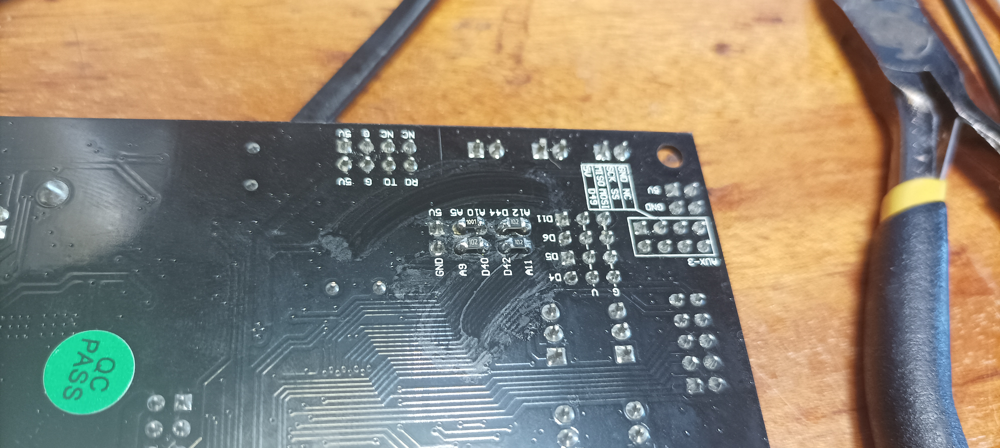
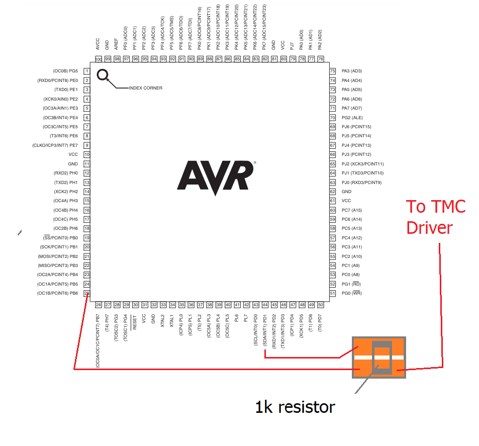
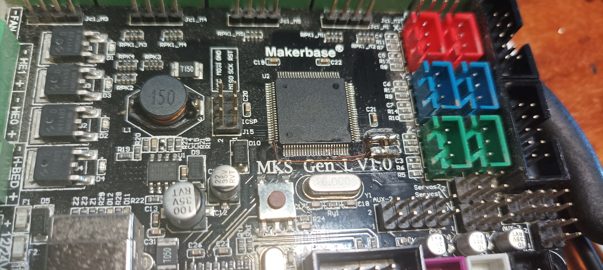
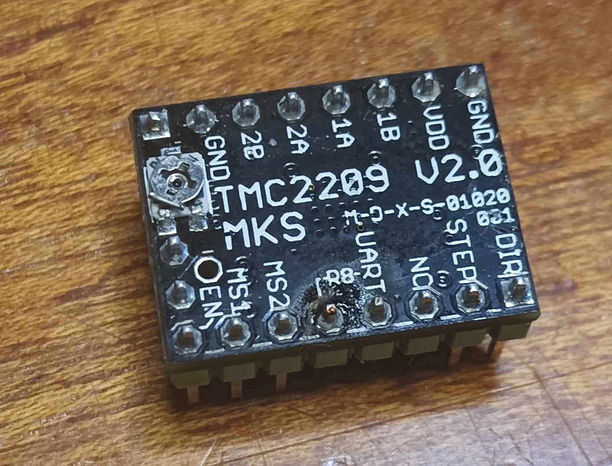
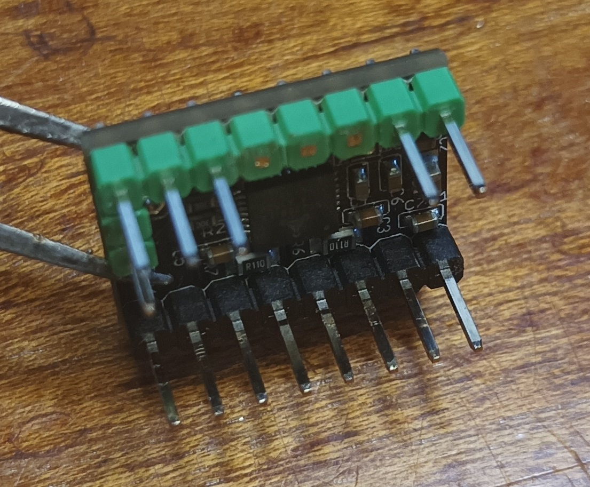
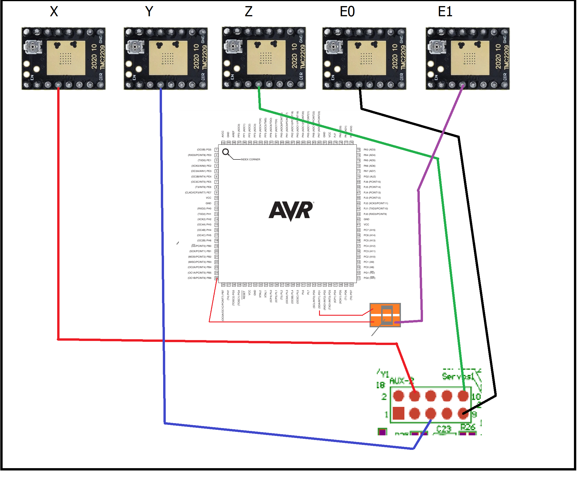
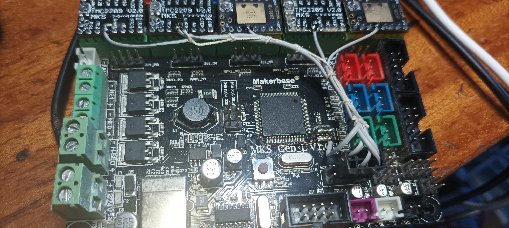

### Introduction

This document shows how to connect TMC2209 drivers via UART to the older MKS GEN L v1.0 board. It also demonstrates how to connect the fifth E1 driver via UART. Additionally, the configuration for KLIPPER is provided.

### MKS modifications

There's a common wiring scheme for TMC drivers on this board, but I propose simplifying it by soldering resistors directly onto the board and connecting the drivers with a single wire. These resistors would be soldered on the reverse side of the board, on the AUX-2 connector. The resistor value should be 1 kΩ.

 

Optionally, if you need to connect the E1 driver via UART, you'll need to solder two wires directly to the microcontroller, specifically to ports PD1 (44 pin) and PB6 (Pin 25). I used a small 3x4mm board to accommodate the resistor. The connection diagram is shown below.

 
 

 ### TMC2209 modifications

 For the drivers to work seamlessly with this board, you can bend 3 pins, or, as I did, cut them off completely.

 
 

 ### Wiring diagramm




### Klipper TMC2209 UART configuration

I'm using two independent motors for the Z axis, with the second motor connected to the E1 connector. You can find the pinout in the following [repository.](https://github.com/makerbase-mks/Klipper-for-MKS-Boards/tree/main/MKS%20Gen%20l)

```
[stepper_x]
step_pin: PF0
dir_pin: !PF1
enable_pin: !PD7
microsteps: 32
rotation_distance: 32   
endstop_pin: !PE5
position_endstop: -8
position_min: -8
position_max: 210
homing_speed: 30

[tmc2209 stepper_x]
uart_pin: PK1
interpolate: False
run_current: 0.7
hold_current: 0.5
sense_resistor: 0.110
stealthchop_threshold: 0

[stepper_y]
step_pin: PF6
dir_pin: PF7
enable_pin: !PF2
microsteps: 32
rotation_distance: 32
endstop_pin: !PJ1
position_endstop: -18
position_min: -18
position_max: 202
homing_speed: 30

[tmc2209 stepper_y]
uart_pin: PK2
interpolate: False
run_current: 0.7
hold_current: 0.5
sense_resistor: 0.110
stealthchop_threshold: 0

[stepper_z]
step_pin: PC1
dir_pin: PC3
enable_pin: !PC7
microsteps: 32
rotation_distance: 4
endstop_pin: probe:z_virtual_endstop
#endstop_pin: !PD3
#position_endstop: 0
position_max: 250
position_min: -3

[tmc2209 stepper_z]
uart_pin: PK3
interpolate: False
run_current: 0.7
hold_current: 0.5
sense_resistor: 0.110
stealthchop_threshold: 0

[stepper_z1]
step_pin: PL3
dir_pin: !PL1
enable_pin: !PK0
microsteps: 32
rotation_distance: 4
endstop_pin: probe:z_virtual_endstop

[tmc2209 stepper_z1]
uart_pin: PB6
interpolate: False
run_current: 0.7
hold_current: 0.5
sense_resistor: 0.110
stealthchop_threshold: 0

[extruder]
step_pin: PA4
dir_pin: !PA6
enable_pin: !PA2
microsteps: 32
rotation_distance: 8.1345
nozzle_diameter: 0.4
filament_diameter: 1.750
max_extrude_cross_section: 0.8
heater_pin: PB4
sensor_type: ATC Semitec 104GT-2
sensor_pin: PK5
min_temp: 0
max_temp: 280
control: pid
pid_Kp: 22.2
pid_Ki: 1.08
pid_Kd: 114

[tmc2209 extruder]
uart_pin: PK4
interpolate: True
run_current: 0.5
hold_current: 0.5
sense_resistor: 0.110
stealthchop_threshold: 999999

```
Please note that the configuration above includes coefficients specific to my printer. Pay attention only to the data pins, as these will be relevant for your setup. Please refer to the documentation to select the correct motor currents and TMC driver operating modes.


